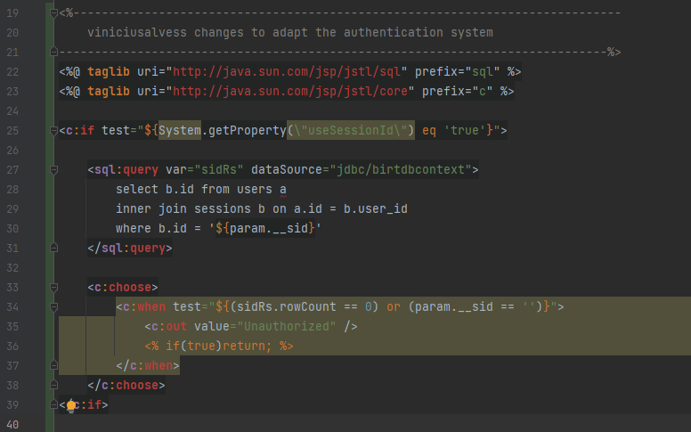

## Introduction

The main goal of this project is to make it easier get BIRT up and running with docker.
I created this project because I have a php app that lacks a good report system and BIRT has multiple great platforms that helps us to design, view and export data.

## Versions

##### Dependencies used to build the docker container
These are the versions of the dependencies currently using to build the container. 
```sh
BIRT Runtime: birt-runtime-4.14.0-202312020807.zip
Tomcat: Tomcat 9.0.86
JDK: Jdk17
JSTL Taglibs: 1.2.5 # Used by the test.jsp page
Apache commons-logging-1.3.0 # Production server throws class not found exception without it
```

##### Other dependencies
I'm listing these below just to be consistent.
```txt
BIRT Designer: birt-report-designer-all-in-one-4.14.0-202312020807
```

## Setup
Notice that we have a ```.env-example``` file that will be passed into the Docker container, so Tomcat jndi context can connect to the database.
You have to rename this file to ```.env``` and setup your database connection before running the container.

```
# MySql
JAVA_OPTS= -Ddb.server=your-server -Ddb.port=3306 -Ddb.username=root -Ddb.password=yourpass -Ddb.database=yourdb -Ddb.jndiname=jdbc/birtdbcontext -Ddb.driverclass=com.mysql.cj.jdbc.Driver -Ddb.type=mysql

# Firebird
#JAVA_OPTS= -Ddb.server=host.docker.internal -Ddb.port=3050 -Ddb.username=sysdba -Ddb.password=yourpass -Ddb.database=path-to-fdb-file -Ddb.jndiname=jdbc/birtdbcontext -Ddb.driverclass=org.firebirdsql.jdbc.FBDriver -Ddb.type=firebirdsql
```

Currently I have is working with Mysql 8, but in the future we can add more jdbc database drivers. 
Modify the .env values according to your needs.

## Building and Running the Docker container

##### Build

###### Run from [Docker Hub](https://hub.docker.com/r/viniciusalvess/birt-docker)
```sh
docker pull viniciusalvess/birt-docker:4.17.0
```

###### Build and Run from cloned project
```sh
docker build -t container-registry/birt:4.17.0 -f ./Dockerfile .
```
##### Run

```sh
docker run -d --network=your-docker-network-if-you-have-one -p 9999:8080 --name birt --env-file ./Docker/birt/.env -v /your-volume-path:/usr/local/tomcat/webapps/ROOT/report container-registry/birt:4.17.0

# --network=your-docker-network-if-you-have-one - This part of the command can be removed if you don't use a separate docker netowork. but if you are connecting to the hosting physical machine from the container, you may need the command below
```

```sh
# connects to the host outside the docker container : http://host.docker.internal:9999/
docker run -d --add-host host.docker.internal:host-gateway -p 9999:8080 --name birt --env-file ./Docker/birt/.env -v  /your-volume-path:/usr/local/tomcat/webapps/ROOT/report container-registry/birt-docker:4.17.0
```


Now you should be able to pull up your browser tab and navigate to http://127.0.0.1:9999 to land on the BIRT home page.

## Miscellaneous and Technical Stuff

This part is not necessary to use this project, these are just technical details for nerd people. So if you ever update anything to adapt your needs you'll know the hoops.

### Tomcat Context Jndi

JNDI connection string takes precedence over JDBC connection string when the BIRT reports tries to connect to the database. While disigning  reports on your development workstation we often don't connect to the production database to create the report. So setup the Jdbc connection on your BIRT report datasource to connect to your development database and have the JNDI url pointing to the production database you desire to connect when the report is deployed to the production environment.
This explains why I had to setup the JNDI context on Tomcat, is so I don't have to be editing the .rptdesing connection string every time I deploy a report to production.

This is the Tomcat docs I followed to be able to setup the context.xml [JNDI Datasource How-To](https://tomcat.apache.org/tomcat-9.0-doc/jndi-datasource-examples-howto.html). 
I basically had to edit the ```context.xml``` file adding the ```<Resource.../>``` tag to connect to the database I want Tomcat to connect to, I also had to modify the ```web.xml``` file that comes with BIRT runtime to use the Tomcat jndi context. 

###### context.xml 


###### web.xml 

Added the JNDI connection to the web.xml


Had to modify the BIRT_VIEWER_WORKING_FOLDER to customize the .rptdesign file location.


### Check if the JNDI is working properly with Tomcat
I created a ```test.jsp``` page that can be accessed here http://127.0.0.1:9999/test.jsp that will load data from a users table. Feel free to modify the select statement on that page and adapt it to your needs.FYI Make sure your database have the table that the test.jsp is trying to access.

### BIRT .rptdesign datasource example

Since I had issues setting up the .rptdesign file to connect to my localhost while design and development and connect JNDI for production, I'm adding a screenshot to the BIRT designer datasource.


##### Assets being served as HTTP instead of HTTPS
Had issues with running the container behind a nginx proxy where the frameset assets were being served as http even though the domain accessing the proxy was https. The browser were throwing an error of "mixed content".
I wasn't sure the correct way to resolve this issue, but I added the meta tag below to force the browser to use https on assets that were being served as http.

```html
<meta http-equiv="Content-Security-Policy" content="upgrade-insecure-requests">
```
#### Files I added the meta tag


### Authentication

Updated the ```FramesetFragment.jsp``` file to evaluate a session id at run time and determine if the user can see the report or not.
With my case I pass in a ```__sid``` query string parameter and run a query on the database to determine if the user can see the report and I also have the ```useSessionId``` environment variable set to true.

You may have to change it to adapt it to your needs.




